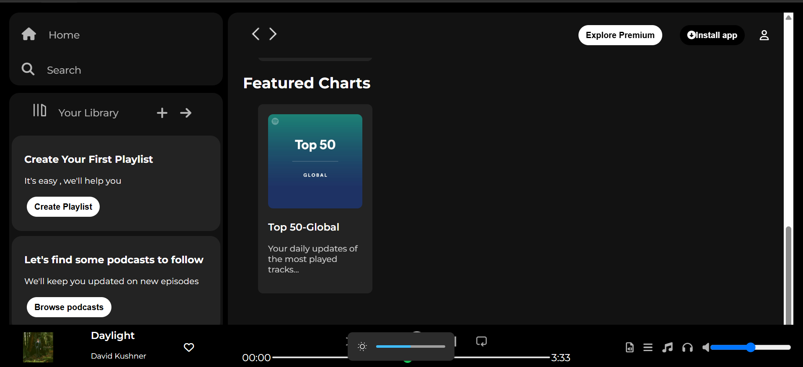

## Spotify Web Player UI Clone

This project is a simple front-end clone of the Spotify Web Player, built using HTML, CSS, and FontAwesome icons. It replicates the UI layout of the Spotify web app with features like a sidebar, main content area, and a music player at the bottom.

## Features
- **Sidebar Navigation:** Includes Home, Search, and Library sections.
- **Main Content:** Displays Recently Played, Trending Now, and Featured Charts sections with cards.
- **Music Player:** A fixed bottom music player with playback controls and volume control.
- **Responsive Design:** Hides certain elements for smaller screens.
- **Hover Effects:** Enhances user experience with hover animations on cards and buttons.

## Technologies Used
- **HTML5** for structuring the content.
- **CSS3** for styling and layout.
- **FontAwesome** for icons.
- **Google Fonts** (Montserrat) for typography.

## Setup Instructions
1. Clone the repository or download the source files.
2. Open `spotify.html` in any modern web browser.
3. Ensure that `spotify.css` is in the same directory for styles to load properly.
4. Make sure the required images (like `logo.png`, `library_icon.png`, `card images`, etc.) are present in the project folder.

## Folder Structure
```
/spotify-clone
│-- index.html (Main HTML file)
│-- spotify.css (Stylesheet)
│-- /assets (Contains images and icons)
```

## Future Enhancements
- Add JavaScript for dynamic interactions.
- Implement an actual music-playing feature.
- Improve responsiveness for better mobile support.

## Screenshot




## Author
Developed by **Drishti Porwal**

## License
This project is for educational purposes only and does not aim to infringe on Spotify's trademarks or copyrights.

